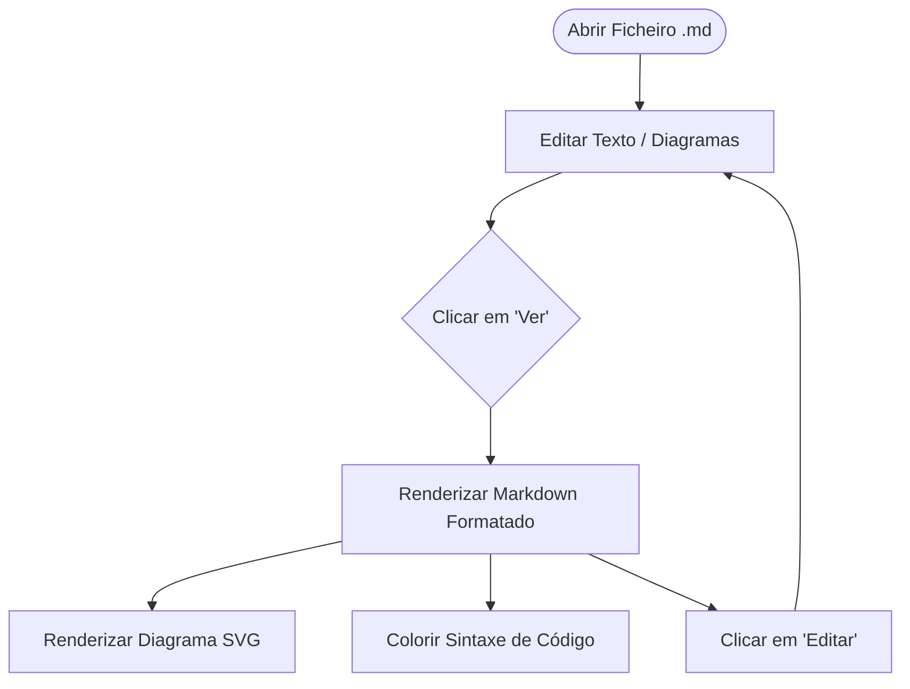
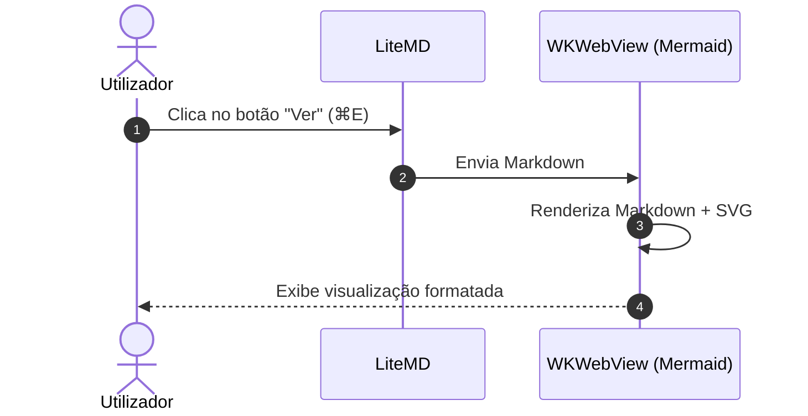

# Exemplo LiteMD

Este é um documento de teste para o **LiteMD**.

## Diagrama de Fluxo (Mermaid)



## Diagrama de Sequência



## Bloco de Código

```swift
import SwiftUI

struct LiteMDView: View {
    var body: some View {
        Text("Superlite e Rápido!")
    }
}
```

## Tabela de Atalhos

| Atalho | Ação |
| :--- | :--- |
| `⌘E` | Alternar entre **Ver** e **Editar** |
| `⌘O` | Abrir ficheiro `.md` |
| `⌘S` | Guardar ficheiro atual |
| Drag & Drop | Arrastar qualquer `.md` para a janela |
