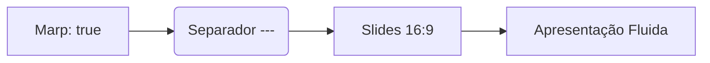

# 🚀 LiteMD Apresentações
### Slides Marp nativos, rápidos e elegantes no macOS
**Por André Sousa**

---

## ⚡ O que é o Marp no LiteMD?

- Comece o ficheiro com `marp: true` no cabeçalho YAML
- Cada slide é separado por `---`
- Proporção padrão **16:9** em cartões com sombra
- Navegue com as **setas do teclado** (← e →) ou barra de espaço
- Suporta temas: `default`, `gaia` e `uncover`

---

## 💻 Suporte de Código com Highlighting

```swift
import SwiftUI

struct SlideView: View {
    var body: some View {
        Text("LiteMD + Marp = ❤️")
            .font(.largeTitle)
    }
}
```

> "Simples, ultraleve e sem configurações complicadas."

---

## 📊 Diagramas Mermaid dentro de Slides!



---

<!-- _class: invert -->

# 🎉 Pronto a Usar!

Alterne para o modo **Editar** (⌘E) para alterar o texto ou crie um **Novo** documento (⌘N).
